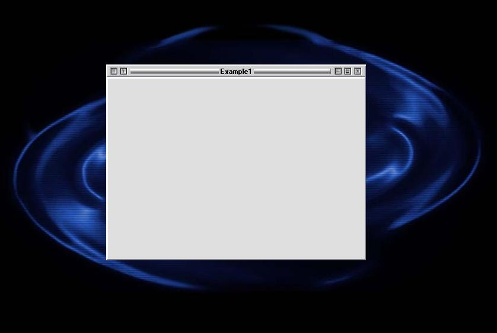



## MAC Window

### Description

I did not make this VBP, it was made by Evan Toder, but as it so good i thought it deserved to be here. This really does look good, all i have done is modified it so that it is easier to undertsand. Plus i have marked out points where you should edit the project. Nothing else needed, just extract and run. Please read the Readme.txt as it will explain alot about the code.
 
### More Info
 

             |
---                |---
**Submitted On**   |2004-06-06 16:27:06
**By**             |[Andrew Cooke](https://github.com/Planet-Source-Code/PSCIndex/blob/master/ByAuthor/andrew-cooke.md)
**Level**          |Beginner
**User Rating**    |5.0 (10 globes from 2 users)
**Compatibility**  |VB 6\.0
**Category**       |[Custom Controls/ Forms/  Menus](https://github.com/Planet-Source-Code/PSCIndex/blob/master/ByCategory/custom-controls-forms-menus__1-4.md)
**World**          |[Visual Basic](https://github.com/Planet-Source-Code/PSCIndex/blob/master/ByWorld/visual-basic.md)
**Archive File**   |[MAC\_Window1781458132004\.zip](https://github.com/Planet-Source-Code/andrew-cooke-mac-window__1-55530/archive/master.zip)

